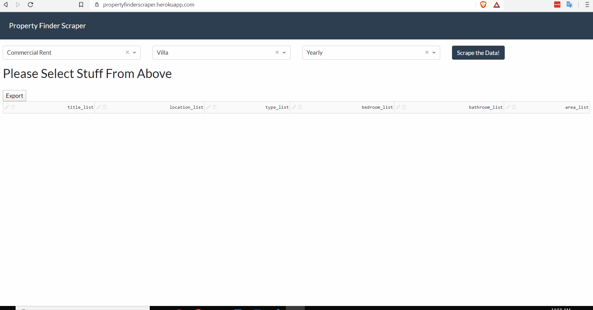
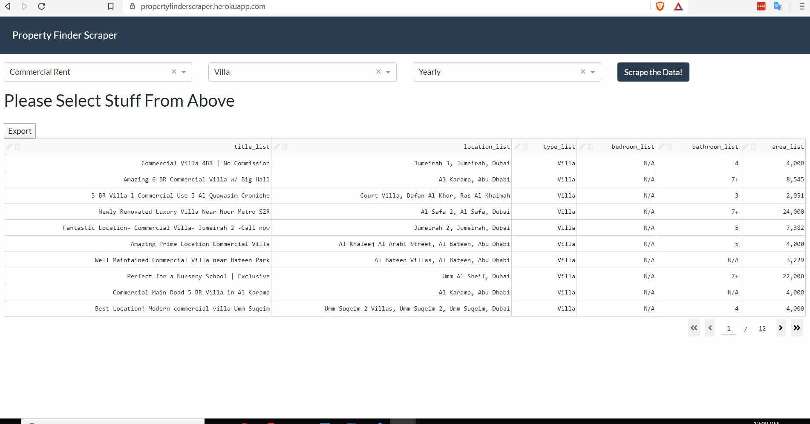

# Property Finder Scraper
## Description
This repository contains the Python code for a web scraper that takes in user input parameters and returns scraped data from this [Property Finder Website](www.propertyfinder.ae) as a downloadeable excel file.

The fully functional website can be found [here](https://propertyfinderscraper.herokuapp.com/).

## Packages Used
### Packages:
- Plotly Dash
- Pandas
- Redis Queue
- BeautifulSoup
- Requests

### Databases:
- Redis
- PostgreSQL

## Running Locally or Deploying
The app in this repository is fully deployable on Heroku or can be run locally as well. The app was adapted from [tcbegley's](https://github.com/tcbegley) repo [dash-rq-demo](https://github.com/tcbegley/dash-rq-demo). Please visit his repo for more details on deployment.

You will need Postgres, a Redis server and/or Heroku (if deploying to Heroku or running Heroku local).

## Interface
### `Selecting Input Parameters and Progress Bar`

### `Editing Data Table and Downloading Excel`

## Acknowledgements
I would like to thank [tcbegley](https://github.com/tcbegley) for his amazing work on async updates in Dash!

## Questions/Contributions/Future Work
I'm very open to any recommendations or contributions! Please reach out to me on Github if you would like to chat.
